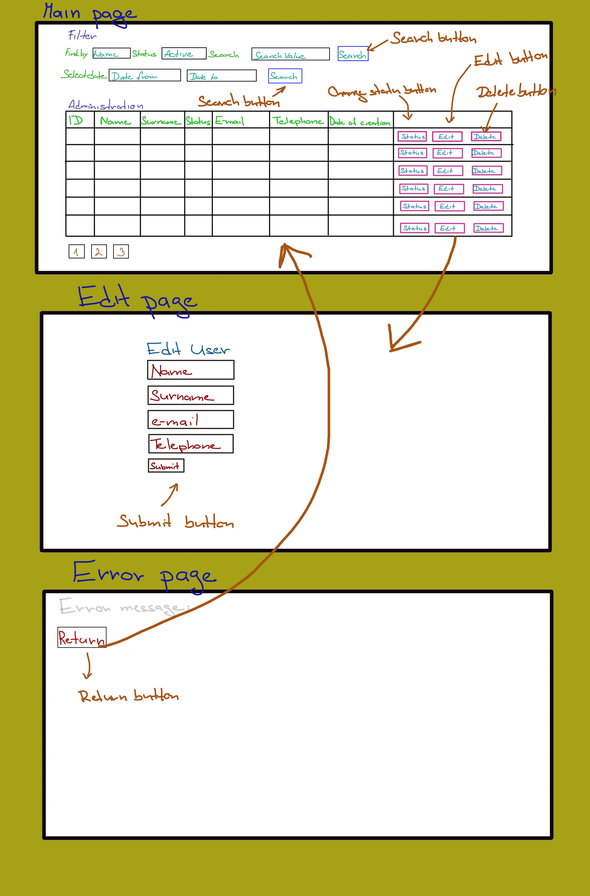

  

 <h1> Administration Project </h1> 

## Workflow
I needed to learn Java and Primefaces for the project. Instead of Primefaces I decided to chose ThymeLeaf, 
because it is quite similar to Razor which I used during the course.

Working on the project was time-demanding because I needed to get familiar with Java MVC and Thymeleaf.

## What the application can do

## PAGINATION
- The application displays three users on a single page and is possible to list between pages.
- User can list between filtered users.
## STATUS
- With table button "change status" is possible to change user status.
- Changing user status does not cause redirection to main page.
##DELETE
- With table button "delete" is possible to delete user.
- Deleting user does not cause redirection to main page.
##EDIT
- With table button "edit" is possible to change any information about user. This button redirect to a new page. In form on page are prepared values of choosed user. User can edit any of them and saved them.
##TIME RANGE
- Application can filter users by their creation time.
- Filter input remains the same after the search is done.
##SEARCH
- The application can filter users by ID, NAME, SURNAME, TELEPHONE and EMAIL. 
- It is possile to filter users by all the properties mentioned above.
- Filter input remains the same after the search is done.
##INPUT 
- The application contains essential error handling, e.g. id does not match any user.
##VIEW
- The visual part of application is focused on comfortable using.
- The user interface of application can handle empty or null input.
- Actual page number is shown.
##TESTING
- Basic set of unit tests was made.

## What the application cannot do

DELETE
- Redirection stops working when all users on actual page are deleted.
EDIT
- After user editing application is redirected to main page.
INPUT
- There are still ways how to drop down the application.

## Room for improvement
- I could improve things that I wrote above.
- I realize that endpoints are in two cases too long.
- I realize that some types of redirections are not correct.

VISUAL DRAFT:

